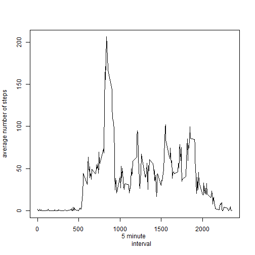

## Loading and preprocessing the data

```r
    # Unzip activity.zip and then read csv file to get dataset - assumes file has been unzipped
    activitydata <- read.csv("./activity.csv", sep = ",", header = TRUE)
    # Convert dates to date format
    activitydata$date <- as.Date(activitydata$date)
```


## What is mean total number of steps taken per day?
### Summarise Data
Summarise data into 
- days
- total steps per day
- mean steps per day (I've assumed removing NAs is the right thing to do here)
- median steps per day (I've assumed removing NAs is the right thing to do here)

```r
    # Note: Assumes dplyr is installed  
    library(dplyr)
    activitydatadf <- tbl_df(activitydata)
    activityDataSummarized <- summarise(group_by(activitydatadf, date), totalSteps = sum(steps), 
                                        mediansteps = median(steps, na.rm= TRUE), meansteps = 
                                        mean(steps, na.rm=TRUE))
```
### Histogram of total number of steps per day   
The following is a historgram of the total number of steps per day:  

```r
    # Plot histogram with total steps in summarized data
    with(activityDataSummarized, hist(totalSteps, main = "Total Steps Per Day", col="red", xlab
                                      ="Total Number Of Steps"))
```

 
### Mean and median number of steps per day   
The mean and median number of steps (as well as the total) are presented below in tabular format per day (Note: Assumes xtable is installed):  

```r
    library(xtable)
    # Convert date back to character for better display in table
    activityDataSummarized$date <- as.character(activityDataSummarized$date)
    xt <- xtable(activityDataSummarized, caption="Mean, Median and Total Steps Per Day")
    print(xt, type="html")
```

<!-- html table generated in R 3.1.1 by xtable 1.7-4 package -->
<!-- Sat Nov 15 23:05:21 2014 -->
<table border=1>
<caption align="bottom"> Mean, Median and Total Steps Per Day </caption>
<tr> <th>  </th> <th> date </th> <th> totalSteps </th> <th> mediansteps </th> <th> meansteps </th>  </tr>
  <tr> <td align="right"> 1 </td> <td> 2012-10-01 </td> <td align="right">  </td> <td align="right">  </td> <td align="right">  </td> </tr>
  <tr> <td align="right"> 2 </td> <td> 2012-10-02 </td> <td align="right"> 126 </td> <td align="right">   0 </td> <td align="right"> 0.44 </td> </tr>
  <tr> <td align="right"> 3 </td> <td> 2012-10-03 </td> <td align="right"> 11352 </td> <td align="right">   0 </td> <td align="right"> 39.42 </td> </tr>
  <tr> <td align="right"> 4 </td> <td> 2012-10-04 </td> <td align="right"> 12116 </td> <td align="right">   0 </td> <td align="right"> 42.07 </td> </tr>
  <tr> <td align="right"> 5 </td> <td> 2012-10-05 </td> <td align="right"> 13294 </td> <td align="right">   0 </td> <td align="right"> 46.16 </td> </tr>
  <tr> <td align="right"> 6 </td> <td> 2012-10-06 </td> <td align="right"> 15420 </td> <td align="right">   0 </td> <td align="right"> 53.54 </td> </tr>
  <tr> <td align="right"> 7 </td> <td> 2012-10-07 </td> <td align="right"> 11015 </td> <td align="right">   0 </td> <td align="right"> 38.25 </td> </tr>
  <tr> <td align="right"> 8 </td> <td> 2012-10-08 </td> <td align="right">  </td> <td align="right">  </td> <td align="right">  </td> </tr>
  <tr> <td align="right"> 9 </td> <td> 2012-10-09 </td> <td align="right"> 12811 </td> <td align="right">   0 </td> <td align="right"> 44.48 </td> </tr>
  <tr> <td align="right"> 10 </td> <td> 2012-10-10 </td> <td align="right"> 9900 </td> <td align="right">   0 </td> <td align="right"> 34.38 </td> </tr>
  <tr> <td align="right"> 11 </td> <td> 2012-10-11 </td> <td align="right"> 10304 </td> <td align="right">   0 </td> <td align="right"> 35.78 </td> </tr>
  <tr> <td align="right"> 12 </td> <td> 2012-10-12 </td> <td align="right"> 17382 </td> <td align="right">   0 </td> <td align="right"> 60.35 </td> </tr>
  <tr> <td align="right"> 13 </td> <td> 2012-10-13 </td> <td align="right"> 12426 </td> <td align="right">   0 </td> <td align="right"> 43.15 </td> </tr>
  <tr> <td align="right"> 14 </td> <td> 2012-10-14 </td> <td align="right"> 15098 </td> <td align="right">   0 </td> <td align="right"> 52.42 </td> </tr>
  <tr> <td align="right"> 15 </td> <td> 2012-10-15 </td> <td align="right"> 10139 </td> <td align="right">   0 </td> <td align="right"> 35.20 </td> </tr>
  <tr> <td align="right"> 16 </td> <td> 2012-10-16 </td> <td align="right"> 15084 </td> <td align="right">   0 </td> <td align="right"> 52.38 </td> </tr>
  <tr> <td align="right"> 17 </td> <td> 2012-10-17 </td> <td align="right"> 13452 </td> <td align="right">   0 </td> <td align="right"> 46.71 </td> </tr>
  <tr> <td align="right"> 18 </td> <td> 2012-10-18 </td> <td align="right"> 10056 </td> <td align="right">   0 </td> <td align="right"> 34.92 </td> </tr>
  <tr> <td align="right"> 19 </td> <td> 2012-10-19 </td> <td align="right"> 11829 </td> <td align="right">   0 </td> <td align="right"> 41.07 </td> </tr>
  <tr> <td align="right"> 20 </td> <td> 2012-10-20 </td> <td align="right"> 10395 </td> <td align="right">   0 </td> <td align="right"> 36.09 </td> </tr>
  <tr> <td align="right"> 21 </td> <td> 2012-10-21 </td> <td align="right"> 8821 </td> <td align="right">   0 </td> <td align="right"> 30.63 </td> </tr>
  <tr> <td align="right"> 22 </td> <td> 2012-10-22 </td> <td align="right"> 13460 </td> <td align="right">   0 </td> <td align="right"> 46.74 </td> </tr>
  <tr> <td align="right"> 23 </td> <td> 2012-10-23 </td> <td align="right"> 8918 </td> <td align="right">   0 </td> <td align="right"> 30.97 </td> </tr>
  <tr> <td align="right"> 24 </td> <td> 2012-10-24 </td> <td align="right"> 8355 </td> <td align="right">   0 </td> <td align="right"> 29.01 </td> </tr>
  <tr> <td align="right"> 25 </td> <td> 2012-10-25 </td> <td align="right"> 2492 </td> <td align="right">   0 </td> <td align="right"> 8.65 </td> </tr>
  <tr> <td align="right"> 26 </td> <td> 2012-10-26 </td> <td align="right"> 6778 </td> <td align="right">   0 </td> <td align="right"> 23.53 </td> </tr>
  <tr> <td align="right"> 27 </td> <td> 2012-10-27 </td> <td align="right"> 10119 </td> <td align="right">   0 </td> <td align="right"> 35.14 </td> </tr>
  <tr> <td align="right"> 28 </td> <td> 2012-10-28 </td> <td align="right"> 11458 </td> <td align="right">   0 </td> <td align="right"> 39.78 </td> </tr>
  <tr> <td align="right"> 29 </td> <td> 2012-10-29 </td> <td align="right"> 5018 </td> <td align="right">   0 </td> <td align="right"> 17.42 </td> </tr>
  <tr> <td align="right"> 30 </td> <td> 2012-10-30 </td> <td align="right"> 9819 </td> <td align="right">   0 </td> <td align="right"> 34.09 </td> </tr>
  <tr> <td align="right"> 31 </td> <td> 2012-10-31 </td> <td align="right"> 15414 </td> <td align="right">   0 </td> <td align="right"> 53.52 </td> </tr>
  <tr> <td align="right"> 32 </td> <td> 2012-11-01 </td> <td align="right">  </td> <td align="right">  </td> <td align="right">  </td> </tr>
  <tr> <td align="right"> 33 </td> <td> 2012-11-02 </td> <td align="right"> 10600 </td> <td align="right">   0 </td> <td align="right"> 36.81 </td> </tr>
  <tr> <td align="right"> 34 </td> <td> 2012-11-03 </td> <td align="right"> 10571 </td> <td align="right">   0 </td> <td align="right"> 36.70 </td> </tr>
  <tr> <td align="right"> 35 </td> <td> 2012-11-04 </td> <td align="right">  </td> <td align="right">  </td> <td align="right">  </td> </tr>
  <tr> <td align="right"> 36 </td> <td> 2012-11-05 </td> <td align="right"> 10439 </td> <td align="right">   0 </td> <td align="right"> 36.25 </td> </tr>
  <tr> <td align="right"> 37 </td> <td> 2012-11-06 </td> <td align="right"> 8334 </td> <td align="right">   0 </td> <td align="right"> 28.94 </td> </tr>
  <tr> <td align="right"> 38 </td> <td> 2012-11-07 </td> <td align="right"> 12883 </td> <td align="right">   0 </td> <td align="right"> 44.73 </td> </tr>
  <tr> <td align="right"> 39 </td> <td> 2012-11-08 </td> <td align="right"> 3219 </td> <td align="right">   0 </td> <td align="right"> 11.18 </td> </tr>
  <tr> <td align="right"> 40 </td> <td> 2012-11-09 </td> <td align="right">  </td> <td align="right">  </td> <td align="right">  </td> </tr>
  <tr> <td align="right"> 41 </td> <td> 2012-11-10 </td> <td align="right">  </td> <td align="right">  </td> <td align="right">  </td> </tr>
  <tr> <td align="right"> 42 </td> <td> 2012-11-11 </td> <td align="right"> 12608 </td> <td align="right">   0 </td> <td align="right"> 43.78 </td> </tr>
  <tr> <td align="right"> 43 </td> <td> 2012-11-12 </td> <td align="right"> 10765 </td> <td align="right">   0 </td> <td align="right"> 37.38 </td> </tr>
  <tr> <td align="right"> 44 </td> <td> 2012-11-13 </td> <td align="right"> 7336 </td> <td align="right">   0 </td> <td align="right"> 25.47 </td> </tr>
  <tr> <td align="right"> 45 </td> <td> 2012-11-14 </td> <td align="right">  </td> <td align="right">  </td> <td align="right">  </td> </tr>
  <tr> <td align="right"> 46 </td> <td> 2012-11-15 </td> <td align="right">  41 </td> <td align="right">   0 </td> <td align="right"> 0.14 </td> </tr>
  <tr> <td align="right"> 47 </td> <td> 2012-11-16 </td> <td align="right"> 5441 </td> <td align="right">   0 </td> <td align="right"> 18.89 </td> </tr>
  <tr> <td align="right"> 48 </td> <td> 2012-11-17 </td> <td align="right"> 14339 </td> <td align="right">   0 </td> <td align="right"> 49.79 </td> </tr>
  <tr> <td align="right"> 49 </td> <td> 2012-11-18 </td> <td align="right"> 15110 </td> <td align="right">   0 </td> <td align="right"> 52.47 </td> </tr>
  <tr> <td align="right"> 50 </td> <td> 2012-11-19 </td> <td align="right"> 8841 </td> <td align="right">   0 </td> <td align="right"> 30.70 </td> </tr>
  <tr> <td align="right"> 51 </td> <td> 2012-11-20 </td> <td align="right"> 4472 </td> <td align="right">   0 </td> <td align="right"> 15.53 </td> </tr>
  <tr> <td align="right"> 52 </td> <td> 2012-11-21 </td> <td align="right"> 12787 </td> <td align="right">   0 </td> <td align="right"> 44.40 </td> </tr>
  <tr> <td align="right"> 53 </td> <td> 2012-11-22 </td> <td align="right"> 20427 </td> <td align="right">   0 </td> <td align="right"> 70.93 </td> </tr>
  <tr> <td align="right"> 54 </td> <td> 2012-11-23 </td> <td align="right"> 21194 </td> <td align="right">   0 </td> <td align="right"> 73.59 </td> </tr>
  <tr> <td align="right"> 55 </td> <td> 2012-11-24 </td> <td align="right"> 14478 </td> <td align="right">   0 </td> <td align="right"> 50.27 </td> </tr>
  <tr> <td align="right"> 56 </td> <td> 2012-11-25 </td> <td align="right"> 11834 </td> <td align="right">   0 </td> <td align="right"> 41.09 </td> </tr>
  <tr> <td align="right"> 57 </td> <td> 2012-11-26 </td> <td align="right"> 11162 </td> <td align="right">   0 </td> <td align="right"> 38.76 </td> </tr>
  <tr> <td align="right"> 58 </td> <td> 2012-11-27 </td> <td align="right"> 13646 </td> <td align="right">   0 </td> <td align="right"> 47.38 </td> </tr>
  <tr> <td align="right"> 59 </td> <td> 2012-11-28 </td> <td align="right"> 10183 </td> <td align="right">   0 </td> <td align="right"> 35.36 </td> </tr>
  <tr> <td align="right"> 60 </td> <td> 2012-11-29 </td> <td align="right"> 7047 </td> <td align="right">   0 </td> <td align="right"> 24.47 </td> </tr>
  <tr> <td align="right"> 61 </td> <td> 2012-11-30 </td> <td align="right">  </td> <td align="right">  </td> <td align="right">  </td> </tr>
   </table>
## What is the average daily activity pattern?
For this, we summarise all intervals(0-2355) with the mean steps. 

The following is a times series plot with the 5 minute daily intervals on the x-axis and average   number of steps taken per day on the y-axis:  

```r
    intervalSummarized <- summarise(group_by(activitydatadf, interval), 
                                    meanSteps = mean(steps, na.rm=TRUE)) 
    plot(intervalSummarized$interval, intervalSummarized$meanSteps, type='l', xlab="5 minute 
         interval", ylab="average number of steps")
```

 
### 5 minute Interval with Average Maximum Steps Accross dataset
The 5 minute interval, on average accross all days, that contains the maximum number of steps is:  

```r
    timeinterval <- filter(intervalSummarized, meanSteps == max(meanSteps))
    xt <- xtable(timeinterval, caption="Interval with maximum average mean steps")
    print(xt, type="html")
```

<!-- html table generated in R 3.1.1 by xtable 1.7-4 package -->
<!-- Sat Nov 15 23:05:21 2014 -->
<table border=1>
<caption align="bottom"> Interval with maximum average mean steps </caption>
<tr> <th>  </th> <th> interval </th> <th> meanSteps </th>  </tr>
  <tr> <td align="right"> 1 </td> <td align="right"> 835 </td> <td align="right"> 206.17 </td> </tr>
   </table>

## Imputing missing values
### Total number of missing values in the dataset 
The total number of NAs for steps in the dataset is calculated using:  

```r
sum(is.na(activitydata$steps))
```

```
## [1] 2304
```
### Strategy for filling in all of the missing values in the dataset
For filling in the missing values, let us use the mean for that interval and create a new dataset without the NAs

```r
    # Loop through all records and replace NAs with interval mean
    activityNoNAs <- activitydata
    for(i in 1:NROW(activityNoNAs)) 
    {
        thisrow = activityNoNAs[i,]
        if (is.na(thisrow$steps)){
            # Loop though intervalmeans - match with interval and substitute meansteps 
            # into new dataset  
            for (j in 1:NROW(intervalSummarized))
            {
                intervalrow = intervalSummarized[j,]
                if (thisrow$interval == intervalrow$interval)
                {
                    activityNoNAs[i,1] <- intervalrow$meanSteps
                }    
            }    
        }
    }
```

### Summarise Data
Summarise data into 
- days
- total steps per day
- mean steps per day (with imputed NAs)
- median steps per day (with imputed NAs)

```r
    # Note: Assumes dplyr is installed  
    library(dplyr)
    activitydfNoNas <- tbl_df(activityNoNAs)
    activityNoNasSummarized <- summarise(group_by(activitydfNoNas, date), 
                                         totalSteps = sum(steps), 
                                        mediansteps = median(steps), meansteps = 
                                        mean(steps))
```

### Histogram of dataset without NAs substituted
The following is a historgram of the total number of steps per day, with NAs substituted:  

```r
    # Plot histogram with total steps in summarized data
    with(activityNoNasSummarized, hist(totalSteps, main = "Total Steps Per Day No NAs", 
                                       col="blue" , xlab ="Total Number Of Steps"))
```

 

As can be seen, the Frequency is slightly higher in this graph with a slight variations to the graph where NAs were imputed.

### Mean and median number of steps per day   
The mean and median number of steps (as well as the total) are presented below in tabular format per day with the NAs replaced:  

```r
    library(xtable)
    # Convert date back to character for better display in table
    activityNoNasSummarized$date <- as.character(activityNoNasSummarized$date)
    xt <- xtable(activityNoNasSummarized, caption="Mean, Median and Total Steps Per Day")
    print(xt, type="html")
```

<!-- html table generated in R 3.1.1 by xtable 1.7-4 package -->
<!-- Sat Nov 15 23:06:25 2014 -->
<table border=1>
<caption align="bottom"> Mean, Median and Total Steps Per Day </caption>
<tr> <th>  </th> <th> date </th> <th> totalSteps </th> <th> mediansteps </th> <th> meansteps </th>  </tr>
  <tr> <td align="right"> 1 </td> <td> 2012-10-01 </td> <td align="right"> 10766.19 </td> <td align="right"> 34.11 </td> <td align="right"> 37.38 </td> </tr>
  <tr> <td align="right"> 2 </td> <td> 2012-10-02 </td> <td align="right"> 126.00 </td> <td align="right"> 0.00 </td> <td align="right"> 0.44 </td> </tr>
  <tr> <td align="right"> 3 </td> <td> 2012-10-03 </td> <td align="right"> 11352.00 </td> <td align="right"> 0.00 </td> <td align="right"> 39.42 </td> </tr>
  <tr> <td align="right"> 4 </td> <td> 2012-10-04 </td> <td align="right"> 12116.00 </td> <td align="right"> 0.00 </td> <td align="right"> 42.07 </td> </tr>
  <tr> <td align="right"> 5 </td> <td> 2012-10-05 </td> <td align="right"> 13294.00 </td> <td align="right"> 0.00 </td> <td align="right"> 46.16 </td> </tr>
  <tr> <td align="right"> 6 </td> <td> 2012-10-06 </td> <td align="right"> 15420.00 </td> <td align="right"> 0.00 </td> <td align="right"> 53.54 </td> </tr>
  <tr> <td align="right"> 7 </td> <td> 2012-10-07 </td> <td align="right"> 11015.00 </td> <td align="right"> 0.00 </td> <td align="right"> 38.25 </td> </tr>
  <tr> <td align="right"> 8 </td> <td> 2012-10-08 </td> <td align="right"> 10766.19 </td> <td align="right"> 34.11 </td> <td align="right"> 37.38 </td> </tr>
  <tr> <td align="right"> 9 </td> <td> 2012-10-09 </td> <td align="right"> 12811.00 </td> <td align="right"> 0.00 </td> <td align="right"> 44.48 </td> </tr>
  <tr> <td align="right"> 10 </td> <td> 2012-10-10 </td> <td align="right"> 9900.00 </td> <td align="right"> 0.00 </td> <td align="right"> 34.38 </td> </tr>
  <tr> <td align="right"> 11 </td> <td> 2012-10-11 </td> <td align="right"> 10304.00 </td> <td align="right"> 0.00 </td> <td align="right"> 35.78 </td> </tr>
  <tr> <td align="right"> 12 </td> <td> 2012-10-12 </td> <td align="right"> 17382.00 </td> <td align="right"> 0.00 </td> <td align="right"> 60.35 </td> </tr>
  <tr> <td align="right"> 13 </td> <td> 2012-10-13 </td> <td align="right"> 12426.00 </td> <td align="right"> 0.00 </td> <td align="right"> 43.15 </td> </tr>
  <tr> <td align="right"> 14 </td> <td> 2012-10-14 </td> <td align="right"> 15098.00 </td> <td align="right"> 0.00 </td> <td align="right"> 52.42 </td> </tr>
  <tr> <td align="right"> 15 </td> <td> 2012-10-15 </td> <td align="right"> 10139.00 </td> <td align="right"> 0.00 </td> <td align="right"> 35.20 </td> </tr>
  <tr> <td align="right"> 16 </td> <td> 2012-10-16 </td> <td align="right"> 15084.00 </td> <td align="right"> 0.00 </td> <td align="right"> 52.38 </td> </tr>
  <tr> <td align="right"> 17 </td> <td> 2012-10-17 </td> <td align="right"> 13452.00 </td> <td align="right"> 0.00 </td> <td align="right"> 46.71 </td> </tr>
  <tr> <td align="right"> 18 </td> <td> 2012-10-18 </td> <td align="right"> 10056.00 </td> <td align="right"> 0.00 </td> <td align="right"> 34.92 </td> </tr>
  <tr> <td align="right"> 19 </td> <td> 2012-10-19 </td> <td align="right"> 11829.00 </td> <td align="right"> 0.00 </td> <td align="right"> 41.07 </td> </tr>
  <tr> <td align="right"> 20 </td> <td> 2012-10-20 </td> <td align="right"> 10395.00 </td> <td align="right"> 0.00 </td> <td align="right"> 36.09 </td> </tr>
  <tr> <td align="right"> 21 </td> <td> 2012-10-21 </td> <td align="right"> 8821.00 </td> <td align="right"> 0.00 </td> <td align="right"> 30.63 </td> </tr>
  <tr> <td align="right"> 22 </td> <td> 2012-10-22 </td> <td align="right"> 13460.00 </td> <td align="right"> 0.00 </td> <td align="right"> 46.74 </td> </tr>
  <tr> <td align="right"> 23 </td> <td> 2012-10-23 </td> <td align="right"> 8918.00 </td> <td align="right"> 0.00 </td> <td align="right"> 30.97 </td> </tr>
  <tr> <td align="right"> 24 </td> <td> 2012-10-24 </td> <td align="right"> 8355.00 </td> <td align="right"> 0.00 </td> <td align="right"> 29.01 </td> </tr>
  <tr> <td align="right"> 25 </td> <td> 2012-10-25 </td> <td align="right"> 2492.00 </td> <td align="right"> 0.00 </td> <td align="right"> 8.65 </td> </tr>
  <tr> <td align="right"> 26 </td> <td> 2012-10-26 </td> <td align="right"> 6778.00 </td> <td align="right"> 0.00 </td> <td align="right"> 23.53 </td> </tr>
  <tr> <td align="right"> 27 </td> <td> 2012-10-27 </td> <td align="right"> 10119.00 </td> <td align="right"> 0.00 </td> <td align="right"> 35.14 </td> </tr>
  <tr> <td align="right"> 28 </td> <td> 2012-10-28 </td> <td align="right"> 11458.00 </td> <td align="right"> 0.00 </td> <td align="right"> 39.78 </td> </tr>
  <tr> <td align="right"> 29 </td> <td> 2012-10-29 </td> <td align="right"> 5018.00 </td> <td align="right"> 0.00 </td> <td align="right"> 17.42 </td> </tr>
  <tr> <td align="right"> 30 </td> <td> 2012-10-30 </td> <td align="right"> 9819.00 </td> <td align="right"> 0.00 </td> <td align="right"> 34.09 </td> </tr>
  <tr> <td align="right"> 31 </td> <td> 2012-10-31 </td> <td align="right"> 15414.00 </td> <td align="right"> 0.00 </td> <td align="right"> 53.52 </td> </tr>
  <tr> <td align="right"> 32 </td> <td> 2012-11-01 </td> <td align="right"> 10766.19 </td> <td align="right"> 34.11 </td> <td align="right"> 37.38 </td> </tr>
  <tr> <td align="right"> 33 </td> <td> 2012-11-02 </td> <td align="right"> 10600.00 </td> <td align="right"> 0.00 </td> <td align="right"> 36.81 </td> </tr>
  <tr> <td align="right"> 34 </td> <td> 2012-11-03 </td> <td align="right"> 10571.00 </td> <td align="right"> 0.00 </td> <td align="right"> 36.70 </td> </tr>
  <tr> <td align="right"> 35 </td> <td> 2012-11-04 </td> <td align="right"> 10766.19 </td> <td align="right"> 34.11 </td> <td align="right"> 37.38 </td> </tr>
  <tr> <td align="right"> 36 </td> <td> 2012-11-05 </td> <td align="right"> 10439.00 </td> <td align="right"> 0.00 </td> <td align="right"> 36.25 </td> </tr>
  <tr> <td align="right"> 37 </td> <td> 2012-11-06 </td> <td align="right"> 8334.00 </td> <td align="right"> 0.00 </td> <td align="right"> 28.94 </td> </tr>
  <tr> <td align="right"> 38 </td> <td> 2012-11-07 </td> <td align="right"> 12883.00 </td> <td align="right"> 0.00 </td> <td align="right"> 44.73 </td> </tr>
  <tr> <td align="right"> 39 </td> <td> 2012-11-08 </td> <td align="right"> 3219.00 </td> <td align="right"> 0.00 </td> <td align="right"> 11.18 </td> </tr>
  <tr> <td align="right"> 40 </td> <td> 2012-11-09 </td> <td align="right"> 10766.19 </td> <td align="right"> 34.11 </td> <td align="right"> 37.38 </td> </tr>
  <tr> <td align="right"> 41 </td> <td> 2012-11-10 </td> <td align="right"> 10766.19 </td> <td align="right"> 34.11 </td> <td align="right"> 37.38 </td> </tr>
  <tr> <td align="right"> 42 </td> <td> 2012-11-11 </td> <td align="right"> 12608.00 </td> <td align="right"> 0.00 </td> <td align="right"> 43.78 </td> </tr>
  <tr> <td align="right"> 43 </td> <td> 2012-11-12 </td> <td align="right"> 10765.00 </td> <td align="right"> 0.00 </td> <td align="right"> 37.38 </td> </tr>
  <tr> <td align="right"> 44 </td> <td> 2012-11-13 </td> <td align="right"> 7336.00 </td> <td align="right"> 0.00 </td> <td align="right"> 25.47 </td> </tr>
  <tr> <td align="right"> 45 </td> <td> 2012-11-14 </td> <td align="right"> 10766.19 </td> <td align="right"> 34.11 </td> <td align="right"> 37.38 </td> </tr>
  <tr> <td align="right"> 46 </td> <td> 2012-11-15 </td> <td align="right"> 41.00 </td> <td align="right"> 0.00 </td> <td align="right"> 0.14 </td> </tr>
  <tr> <td align="right"> 47 </td> <td> 2012-11-16 </td> <td align="right"> 5441.00 </td> <td align="right"> 0.00 </td> <td align="right"> 18.89 </td> </tr>
  <tr> <td align="right"> 48 </td> <td> 2012-11-17 </td> <td align="right"> 14339.00 </td> <td align="right"> 0.00 </td> <td align="right"> 49.79 </td> </tr>
  <tr> <td align="right"> 49 </td> <td> 2012-11-18 </td> <td align="right"> 15110.00 </td> <td align="right"> 0.00 </td> <td align="right"> 52.47 </td> </tr>
  <tr> <td align="right"> 50 </td> <td> 2012-11-19 </td> <td align="right"> 8841.00 </td> <td align="right"> 0.00 </td> <td align="right"> 30.70 </td> </tr>
  <tr> <td align="right"> 51 </td> <td> 2012-11-20 </td> <td align="right"> 4472.00 </td> <td align="right"> 0.00 </td> <td align="right"> 15.53 </td> </tr>
  <tr> <td align="right"> 52 </td> <td> 2012-11-21 </td> <td align="right"> 12787.00 </td> <td align="right"> 0.00 </td> <td align="right"> 44.40 </td> </tr>
  <tr> <td align="right"> 53 </td> <td> 2012-11-22 </td> <td align="right"> 20427.00 </td> <td align="right"> 0.00 </td> <td align="right"> 70.93 </td> </tr>
  <tr> <td align="right"> 54 </td> <td> 2012-11-23 </td> <td align="right"> 21194.00 </td> <td align="right"> 0.00 </td> <td align="right"> 73.59 </td> </tr>
  <tr> <td align="right"> 55 </td> <td> 2012-11-24 </td> <td align="right"> 14478.00 </td> <td align="right"> 0.00 </td> <td align="right"> 50.27 </td> </tr>
  <tr> <td align="right"> 56 </td> <td> 2012-11-25 </td> <td align="right"> 11834.00 </td> <td align="right"> 0.00 </td> <td align="right"> 41.09 </td> </tr>
  <tr> <td align="right"> 57 </td> <td> 2012-11-26 </td> <td align="right"> 11162.00 </td> <td align="right"> 0.00 </td> <td align="right"> 38.76 </td> </tr>
  <tr> <td align="right"> 58 </td> <td> 2012-11-27 </td> <td align="right"> 13646.00 </td> <td align="right"> 0.00 </td> <td align="right"> 47.38 </td> </tr>
  <tr> <td align="right"> 59 </td> <td> 2012-11-28 </td> <td align="right"> 10183.00 </td> <td align="right"> 0.00 </td> <td align="right"> 35.36 </td> </tr>
  <tr> <td align="right"> 60 </td> <td> 2012-11-29 </td> <td align="right"> 7047.00 </td> <td align="right"> 0.00 </td> <td align="right"> 24.47 </td> </tr>
  <tr> <td align="right"> 61 </td> <td> 2012-11-30 </td> <td align="right"> 10766.19 </td> <td align="right"> 34.11 </td> <td align="right"> 37.38 </td> </tr>
   </table>
As can be seen, days where previously no values existed now have a median and mean. As these dates had no totalsteps, the overall totalsteps has increased

## Are there differences in activity patterns between weekdays and weekends?
### Creation of new factor with two levels - "weekday" and "weekend"

```r
    # Note - assumes lubridate installed
    library(lubridate)
    # Keep it simple - mutate into column, 1=Sunday, 7= Saturday, rest weekdays and then factor
    activityweekday <- mutate(activitydatadf, weekdaynum = wday(date), 
                              daytype = ifelse((weekdaynum==1|weekdaynum==7),
                                               "weekend","weekday"))
    activityweekday$weekday = factor(activityweekday$daytype, levels=c("weekday","weekend"))
    # Summarise average steps for plot
    weekdaySummarized <- summarise(group_by(activityweekday, weekday, interval), 
                                    meanSteps = mean(steps, na.rm=TRUE)) 
```
### Plot average number of steps per 5 minute interval by weekday type  

```r
    # Using ggplot2, so assumes this is installed
    library(ggplot2)
    # Keeping it simple for code readability - plot by interval and average steps taken
    timeserisplot <- ggplot(weekdaySummarized, aes(interval, meanSteps))
    # Needs to be line plot as per instructions
    timeserisplot <- timeserisplot + geom_line() + geom_smooth()
    # Add weekday/weekend distinction
    timeserisplot<- timeserisplot + facet_grid(. ~ weekday)
    print(timeserisplot)
```

```
## geom_smooth: method="auto" and size of largest group is <1000, so using loess. Use 'method = x' to change the smoothing method.
## geom_smooth: method="auto" and size of largest group is <1000, so using loess. Use 'method = x' to change the smoothing method.
```

 

As can be seen from the plot, although the overall trend is higher at weekend over multiple intervals, the highest overall average step total is during the week before the interval 1000.
